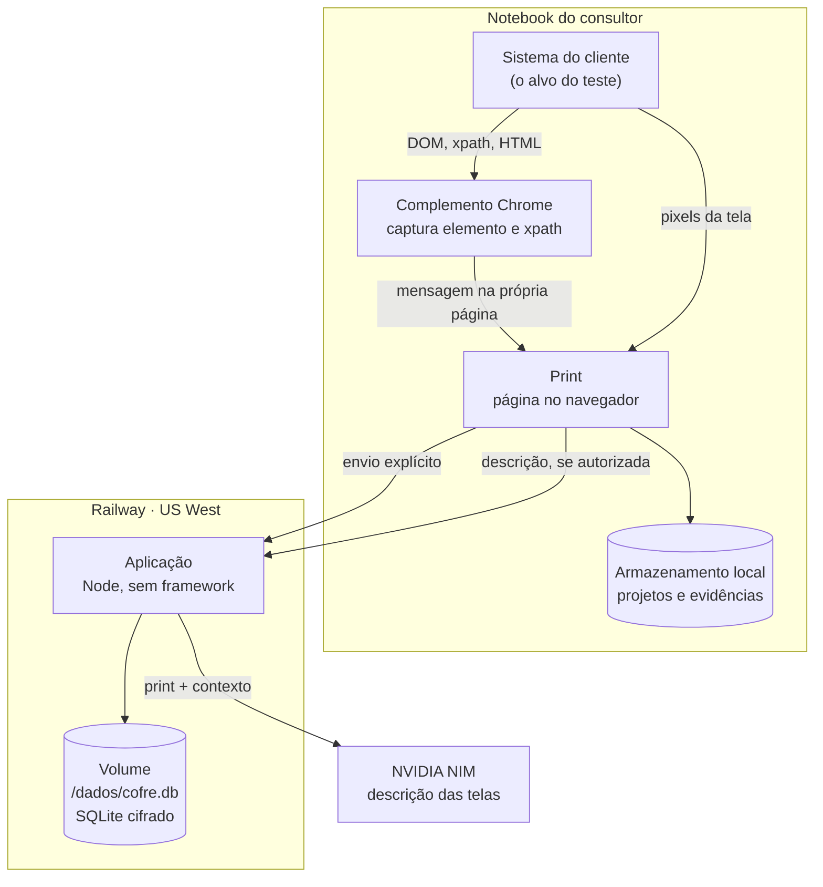
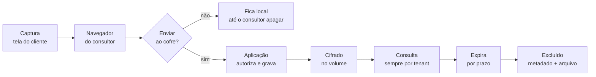
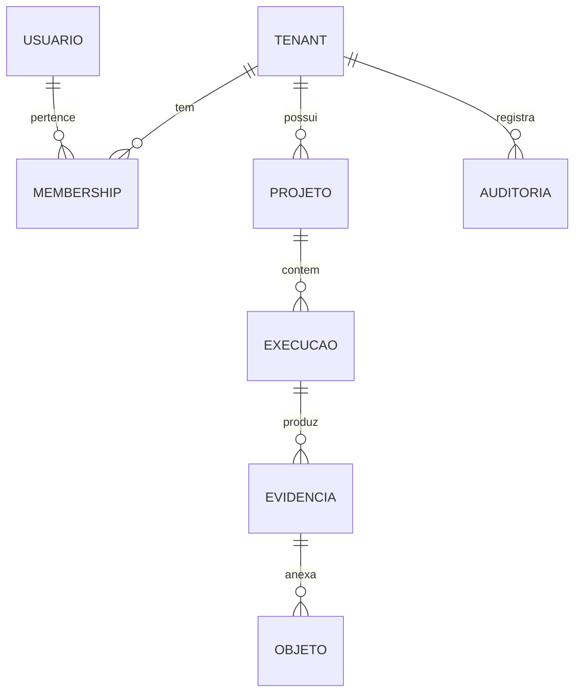

# Print · Arquitetura de segurança e fluxo do dado

Para quem precisa entender o produto sem ler o código: Segurança da Informação, TI, Jurídico e Compras.

Escrito a partir do código, não da intenção. Cada afirmação aqui tem um teste ou um comando que a demonstra, listados em `seguranca-evidencias.md`.

Atualizado em 24/08/2026.

---

## 1. O que o Print é

Uma ferramenta de captura de evidência de teste. Um consultor grava a tela enquanto executa um roteiro, e o sistema monta o registro: print antes e depois de cada interação, o elemento acionado, a URL, e uma descrição do que mudou.

Duas partes, e a diferença entre elas é a coisa mais importante deste documento:

**O Print** roda no navegador do consultor. A evidência nasce ali e, por padrão, **fica ali**: no armazenamento local do navegador. Nada sai da máquina só por gravar.

**O cofre** é o servidor. A evidência só chega nele quando alguém clica em enviar, e a partir daí ela tem dono, prazo e registro de acesso.

Essa separação é deliberada. Gravar não expõe nada. Guardar é uma decisão explícita.

---

## 2. Componentes

**Fronteiras de confiança**, do menos para o mais confiável:

| Zona | Confiança | Por quê |
|---|---|---|
| Sistema do cliente | **Nenhuma** | Conteúdo de terceiro. Pode conter texto que tenta manipular o gerador de descrição |
| Complemento e Print | Média | Rodam na máquina do consultor, sob o navegador dele |
| Aplicação | Alta | Código nosso, e o único lugar que decide autorização |
| Volume | Alta | Disco gerenciado, conteúdo cifrado pela aplicação |
| NVIDIA | **Externa** | Subprocessador. Recebe print e contexto quando autorizado |

---

## 3. Fluxo do dado, origem a descarte

### Etapa por etapa

| Etapa | Onde | O que trafega | Quem autoriza |
|---|---|---|---|
| Captura DOM | Complemento, na máquina | xpath, rótulo, HTML do elemento | Ninguém: é local |
| Captura de tela | Print, na máquina | Pixels via compartilhamento de tela | O consultor, ao compartilhar |
| Descrição | Aplicação para NVIDIA | Print, HTML do elemento, URL da tela | Consentimento por projeto |
| Envio ao cofre | Print para aplicação | Print, metadados do passo | Sessão autenticada |
| Consulta | Aplicação | Só o que pertence ao tenant da sessão | Sessão autenticada |
| Exclusão | Aplicação | Metadado e arquivo, na mesma transação | Papel gestor ou acima |

### O que **não** sai da máquina

O vídeo da gravação. Ele existe só no navegador do consultor e é oferecido para download local.

### O que é removido antes de virar evidência

Senha, CPF, CNPJ e cartão de crédito. O complemento reconhece esses campos pelo tipo, pelo nome, pelo `autocomplete` e pelo formato do valor (cartão validado por Luhn, para não confundir com número de pedido). O valor digitado e o `value` dentro do HTML capturado são substituídos antes de a evidência existir.

---

## 4. Isolamento entre clientes

O modelo é multitenant com banco compartilhado e isolamento lógico forte.

**Toda tabela de dado de cliente carrega `tenant_id`**, inclusive as folhas. Não há derivação por junção na hora da consulta, porque é assim que o isolamento se perde quando alguém escreve uma consulta nova com pressa.

**Toda função de acesso ao banco exige o tenant como argumento** e falha se ele não vier. Não é uma checagem que o programador pode esquecer; é um argumento obrigatório.

**O tenant vem sempre da sessão**, nunca do corpo ou da URL da requisição. Aceitar o tenant do cliente seria devolver a ele a chave do próprio isolamento.

Consequência prática: pedir um registro de outro cliente informando o id dele não devolve "encontrado, mas não é seu". Devolve **não encontrado**, porque a consulta nem o alcança.

### A exceção declarada: equipe provedora

A Auditeste é a consultoria e cada cliente tem a própria equipe. Uma equipe pode ser marcada como provedora, e seus membros passam a alcançar a equipe de cada cliente, levando o próprio papel.

Três travas:

* A marca **só se põe por linha de comando** no servidor, nunca por rota. Se uma conta pudesse se declarar provedora, bastaria criar uma equipe para ver todas as outras.
* **Cliente nunca alcança ninguém.** O isolamento entre clientes permanece integral: um cliente não vê outro, e não vê a consultoria.
* **Cada entrada da provedora fica na auditoria do cliente**, com ação própria, dizendo qual consultoria entrou. O cliente consegue ver quem entrou na casa dele.

---

## 5. Identidade e acesso

| Aspecto | Como é |
|---|---|
| Senha | scrypt com sal por usuário, N=16384, r=8, p=1, 32 bytes. Mínimo de 10 caracteres |
| Sessão | Token aleatório de 32 bytes; o banco guarda só o SHA-256 dele |
| Cookie | `HttpOnly`, `SameSite=Lax`, `Secure` quando a borda é HTTPS |
| Duração | 12 horas |
| Revogação | Sair revoga; trocar senha revoga todas; perder o vínculo derruba na hora |
| Força bruta | 8 tentativas por conta em 15 minutos |
| Papéis | leitor, consultor, gestor, admin |

Entrar em equipe existente exige **convite de uso único**, gerado por gestor ou acima, com prazo. O banco guarda só o hash do código. Ninguém convida para papel acima do próprio.

Cadastro sem convite cria uma **equipe nova**. Não existe caminho para escolher uma equipe existente digitando o nome dela.

---

## 6. Proteção do conteúdo

**Em trânsito.** HTTPS obrigatório. HTTP responde redirecionamento permanente, e a aplicação faz isso por conta própria, sem depender da borda. HSTS de um ano.

**Em repouso.** O conteúdo dos prints é cifrado com AES-256-GCM antes de ir para o banco, com chave em variável de ambiente. GCM autentica: conteúdo adulterado no arquivo é recusado na leitura, não devolvido corrompido.

Cifrar o print e não o metadado é decisão consciente: o print **é** a evidência, é nele que aparece a tela do cliente. Cifrar o metadado e deixar a imagem legível seria teatro.

**Sem URL pública.** Nenhum arquivo é servido sem passar pela autorização. Quando é preciso uma URL que se sustente sozinha, ela é assinada por HMAC e vale 5 minutos, amarrando objeto, cliente e validade.

---

## 7. Ciclo de vida e descarte

Toda evidência nasce com data de criação, data de expiração e estado. O prazo é por cliente, com padrão de 90 dias.

Uma varredura roda dentro do próprio processo, de hora em hora, e apaga o que venceu. Não depende de agendador externo, porque prazo que depende de alguém lembrar de agendar não é prazo.

**Excluir apaga o metadado e o arquivo na mesma transação.** Apagar só a linha deixaria o arquivo órfão, e órfão é exatamente o arquivo que ninguém sabe que ainda existe.

É possível **excluir tudo de um cliente** num comando, com confirmação pelo nome. Os registros de auditoria permanecem, para que a exclusão em si continue comprovável.

No complemento, sessões guardadas são descartadas após 7 dias, e excluir o projeto no Print alcança a cópia guardada lá.

---

## 8. Registro de auditoria

Dezenove eventos, sempre com quem, quando, qual cliente, qual ação e qual recurso:

`login` · `logout` · `login.falhou` · `usuario.criado` · `permissao.alterada` · `senha.trocada` · `equipe.criada` · `equipe.trocada` · `equipe.acessada_pela_provedora` · `convite.criado` · `projeto.criado` · `projeto.excluido` · `execucao.criada` · `evidencia.criada` · `evidencia.listada` · `evidencia.vista` · `evidencia.excluida` · `objeto.baixado` · `tenant.dados_excluidos`

O registro **não guarda** corpo de requisição, cabeçalho de autorização, cookie nem conteúdo de print. Há teste que falha se isso mudar.

A auditoria de um cliente é visível apenas dentro dele.

---

## 9. Uso de modelo de linguagem

O sistema envia print, HTML do elemento e URL da tela para um serviço externo, que devolve a descrição do passo.

**Controles:**

* **Consentimento por projeto.** Desligado, nada sai da máquina, e a captura continua funcionando normalmente.
* **Registro local de cada envio**, com data, rota, quantidade de passos, tamanho e destino.
* **Fronteira de confiança.** O conteúdo do sistema testado vai dentro de um delimitador sorteado a cada chamada, e a instrução declara que ali dentro é dado, nunca ordem. A regra vale explicitamente para texto escrito dentro das imagens.
* **Detecção de tentativa de manipulação.** Frase que tenta dar ordem marca a evidência com aviso visível. Marcar em vez de esconder é deliberado: quem lê a evidência precisa saber que aquela tela tentou influenciar a descrição.
* **Conferência da resposta.** Resposta que repete a fronteira ou muda de papel é descartada, e o passo pede descrição manual.

**Sem ferramentas.** O modelo não executa ações, não acessa o banco e não chama nada. Ele recebe texto e imagem e devolve texto. Por isso não existe allowlist de ferramentas: não existe ferramenta.

**Limite conhecido:** a detecção lê texto, não pixel. Instrução escrita dentro da imagem passa pela detecção, e é coberta apenas pela fronteira declarada no prompt.

---

## 10. Limites de uso

| Limite | Valor |
|---|---|
| Tentativas de login por conta | 8 por 15 minutos |
| Chamadas por sessão | 240 por minuto |
| Chamadas por origem | 600 por minuto |
| Equipes novas por origem | 5 por 15 minutos |
| Tamanho de um print ou vídeo | 20 MB |
| Corpo de requisição | 25 MB |

O teto por origem é alto e isso é intencional: um endereço não é uma pessoa, e um escritório inteiro atrás de uma saída única chega como origem única. Teto apertado não impede ataque e derruba equipe legítima.

---

## 11. Subprocessadores

| Quem | Para quê | O que recebe | Onde |
|---|---|---|---|
| Railway | Hospedagem e volume | Tudo que o cofre guarda | Estados Unidos, região US West |
| NVIDIA | Descrição das telas | Print, HTML do elemento, URL da tela | Estados Unidos |
| GitHub | Código e integração contínua | Código. Nenhuma evidência | Estados Unidos |

**Os dados residem fora do Brasil.** Para contrato sujeito à LGPD, isso caracteriza transferência internacional e precisa estar previsto. Não é decisão técnica: é decisão contratual da Auditeste.

---

## 12. O que este documento não afirma

Honestidade é parte do controle, então o que está em aberto:

* **Criptografia do volume pelo provedor** não foi verificada. A cifra que existe é a da aplicação, sobre o conteúdo dos prints.
* **Dependências sem vulnerabilidade conhecida.** As 22 que existiam (6 altas), todas na cadeia do navegador headless, foram corrigidas subindo puppeteer e lighthouse, com o scan dos três motores testado depois.
* **Sem SSO**, sem análise estática, sem teste dinâmico, sem pentest independente.
* **Sem plano formal de resposta a incidente** e sem política de retenção contratual definida.
* **Backup existe e a restauração é testada**, mas guardar cópia fora do servidor é procedimento operacional ainda não estabelecido.

---

## 13. Onde ler mais

| Documento | Assunto |
|---|---|
| `seguranca-faq.md` | Perguntas frequentes e questionário de fornecedor |
| `seguranca-evidencias.md` | Qual teste ou comando prova cada controle |
| `segredos-e-chaves.md` | Inventário de segredos, o que protegem, como girar |
| `seguranca-marco-1-diagnostico.md` | O diagnóstico que originou este trabalho |
| `subir-o-cofre.md` | Procedimento de instalação e configuração |
