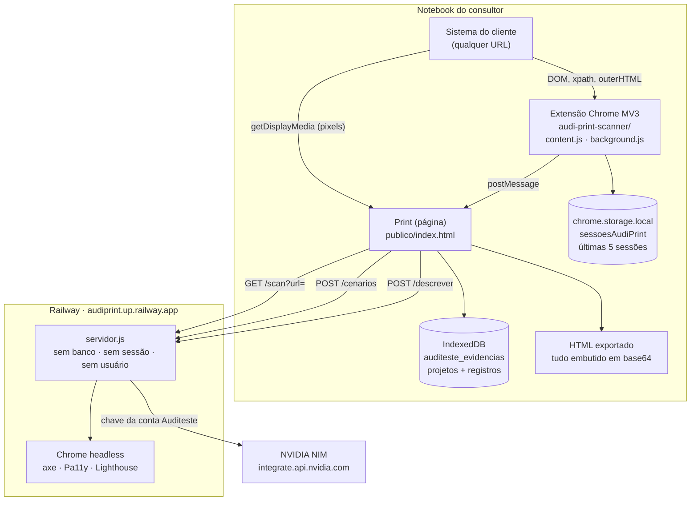
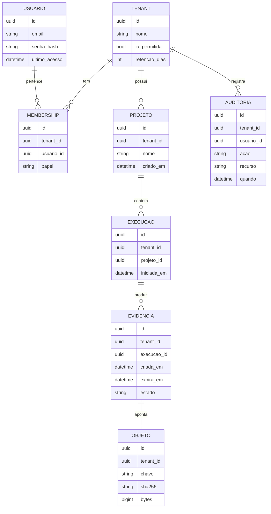

# Print · Diagnóstico técnico do Marco 1 de Segurança

Investigação sobre o código em `Pedro-auditeste/Auditeste-Print`, branch `seguranca-print`, base `b1dd4dc`.
Produção verificada em `https://audiprint.up.railway.app` no dia 21/08/2026.

Este documento é diagnóstico. Nenhum código foi alterado.

---

## 1. Resumo executivo

O Print não é o SaaS que a Epic pressupõe. Não existe backend com banco, usuário, sessão ou storage de evidência. O servidor (`auditeste-a11y/servidor.js`, 400 linhas de `http.createServer`) é uma ponte sem estado: roda scans de acessibilidade, repassa prints para a IA da NVIDIA e serve arquivos estáticos. A evidência inteira (prints, vídeo, HTML capturado, ficha) vive no IndexedDB `auditeste_evidencias` do navegador do consultor, mais uma cópia parcial no `chrome.storage.local` da extensão.

Consequência: **oito dos dez controles do Marco 1 não estão ausentes por atraso de implementação, estão ausentes por não existir a camada onde eles morariam.** Não há tabela para receber `tenant_id`, não há query para filtrar, não há bucket para tornar privado, não há registro para auditar.

O maior risco confirmado não é o isolamento entre clientes. É que a ponte em produção está **aberta para a internet inteira**: `exigeToken:false`, e o único portão (`mesmaOrigem`) confere o cabeçalho `Origin`, que qualquer cliente que não seja navegador forja. Confirmei com um `curl` (seção 5.1).

Distância até o Marco 1: a decisão de arquitetura vem antes do backlog. Enquanto a evidência morar só no notebook do consultor, as perguntas da Ailos ("onde fica? quem acessou? por quanto tempo?") têm como resposta honesta "no disco de quem gravou, sem controle nosso, para sempre".

Mudança arquitetural recomendada: seção 7.

---

## 2. Arquitetura atual

Três peças, e a peça que guarda a evidência é o navegador.



Pontos que a leitura do código fixa:

* Não há `package.json` com ORM, driver de banco, biblioteca de sessão ou SDK de storage. `auditeste-a11y/package.json` traz puppeteer, axe, pa11y, lighthouse. Só.
* `servidor.js` não faz nenhuma escrita em disco no caminho servido. `gravar()` em `a11y.js:68` existe, mas só é chamada por `comAxe`/`comPa11y`/`comLighthouse` (`a11y.js:187,197,207`), que pertencem ao CLI `principal()`, não às rotas HTTP.
* Todo o produto de interface está em um arquivo: `auditeste-a11y/publico/index.html`, 4470 linhas, espelhado byte a byte em `audi-print/evidencias-auditeste.html`.

---

## 3. Fluxo atual da evidência

| Etapa | Componente | Arquivo | Identidade do usuário | Identidade do cliente |
|---|---|---|---|---|
| Captura DOM | content script | `audi-print-scanner/content.js:249` | nenhuma | nenhuma |
| Captura pixel | `getDisplayMedia` | `publico/index.html:1969` | nenhuma | nenhuma |
| Fila e dedupe | service worker | `audi-print-scanner/background.js:32,43` | nenhuma | `tabId` (efêmero) |
| Entrega ao Print | postMessage | `content.js:310` | nenhuma | nenhuma |
| Persistência | IndexedDB | `publico/index.html:1244` | nenhuma | campo livre `cliente` |
| Descrição por IA | `POST /descrever` | `publico/index.html:2547` | nenhuma | nenhuma |
| Processamento | ponte | `servidor.js:284` | nenhuma | nenhuma |
| Terceiro | NVIDIA | `agente-cenarios.js:385` | chave única da conta | nenhuma |
| Consulta | leitura local | `publico/index.html:1265` | nenhuma | `projetoId` |
| Exportação | download | `publico/index.html:3735,3850` | nenhuma | nenhuma |
| Exclusão | IndexedDB delete | `publico/index.html:1816` | nenhuma | por projeto |

O que sai da máquina em `POST /descrever` (`index.html:2531` em diante), por passo:

`imagem` (print depois), `antes` (print antes), `par` (montagem antes/depois), `elemento` (seletor), `rotulo`, `acao`, `valor` (o que foi digitado), `html` (`outerHTML` do elemento do sistema do cliente), `textoAntes`, `textoDepois`, `urlAntes`, `urlDepois`, `modulo`, `tipoTeste`.

Ou seja: **prints do sistema do cliente, trechos de HTML do sistema do cliente e as URLs internas do sistema do cliente atravessam a Railway e vão para a NVIDIA.** Sem consentimento por projeto, sem allowlist de cliente, sem registro de que foi enviado.

O campo `valor` é mascarado para `input[type=password]` (`content.js:249`). Nenhum outro campo é mascarado: CPF, token colado em campo de texto, chave de API digitada em campo comum vão inteiros.

---

## 4. Matriz do Marco 1

| Controle | Estado | Evidência encontrada | Gap | Prioridade |
|---|---|---|---|---|
| Tenancy | 🔴 AUSENTE | `projetos` tem campo `cliente` livre e opcional (`index.html:1210,1566`) | Rótulo, não fronteira. Nada valida, nada filtra por ele | P0 |
| Autenticação | 🔴 AUSENTE | Nenhuma rota de login. `PUBLICO` servido sem verificação (`servidor.js:327`) | Não existe identidade em lugar nenhum | P0 |
| Autorização | 🔴 AUSENTE | Único portão é `tokenInvalido` (`servidor.js:210`), sobre a ponte, não sobre a evidência | Sem recurso no servidor, não há ownership a validar | P0 |
| Storage privado | ⚪ NÃO SE APLICA HOJE | Sem bucket. IndexedDB, `chrome.storage.local`, HTML exportado | Evidência num disco não gerenciado, sem cifra própria | P0 |
| HTTPS/TLS | ✅ IMPLEMENTADO | `http://` responde 301 para `https://`, TLS da Railway | Falta HSTS. Nenhum header de segurança na resposta | P2 |
| Cripto em repouso | ⚪ NÃO FOI POSSÍVEL VERIFICAR | Depende do BitLocker do notebook, não do repositório | Pedro precisa conferir se as máquinas dos consultores têm cifra de disco | P1 |
| Ciclo de vida | 🟡 PARCIAL | `criadoEm` no projeto (`index.html:1566`), `inicio`/`encerrada` na sessão (`background.js:431`) | Registro de evidência não tem data própria nem estado | P1 |
| Retenção/exclusão | 🟡 PARCIAL | Exclusão em cascata funciona (`index.html:1816`). Extensão poda em 5 sessões (`background.js:420,437`) | Sem prazo. Sessão antiga sobrevive para sempre se houver menos de 5 depois. Excluir projeto não limpa a extensão. HTML exportado é incontrolável | P1 |
| Secrets | 🟡 PARCIAL | `.env` e `chave.txt` ignorados e nunca versionados (`git log --all` vazio para os dois) | Chave viva exposta pela ponte aberta (achado P0-1) | P0 |
| Audit log | 🔴 AUSENTE | Só `console.log` operacional (`servidor.js:312,369`) | Impossível responder quem criou, viu, baixou ou excluiu | P0 |

Nenhuma linha foi marcada implementada por inferência. A única ✅ foi medida com `curl`.

---

## 5. Achados P0 (bloqueadores)

### 5.1 · P0-1 · A ponte em produção aceita chamadas de qualquer um

**Onde:** `servidor.js:180` (`mesmaOrigem`), `servidor.js:210` (`tokenInvalido`).

Sem `PONTE_TOKEN`, o servidor libera quando o cabeçalho `Origin` ou `Referer` bate com o host. Esses cabeçalhos são garantia do navegador contra páginas de terceiros, nunca contra um cliente HTTP qualquer.

Produção confirma o modo frágil:

```
GET /ping  ->  {"exigeToken":false,"modo":"mesma-origem","cenarios":true}
```

Bypass reproduzido hoje:

```
sem cabeçalho Origin                                 -> 401
com -H "Origin: https://audiprint.up.railway.app"    -> 200 e o resultado do scan
```

**Cenário de risco:** qualquer pessoa na internet consome `/descrever` e `/cenarios` na chave NVIDIA da Auditeste (custo e cota), manda as próprias imagens para a IA por nossa conta, e usa `/scan` como proxy para varrer alvos externos com o IP da Railway. `PONTE_DOMINIOS` está vazio, então a allowlist está desligada.

**Correção:** definir `PONTE_TOKEN` agora, antes de qualquer outra coisa deste documento. É variável de ambiente na Railway, não exige mudança de código. Em seguida trocar o modo `mesma-origem` por autenticação real, porque `mesma-origem` é heurística de conveniência e não deve sobreviver ao produto virar B2B.

### 5.2 · P0-2 · Evidência de cliente já vai para um terceiro sem controle nenhum

**Onde:** `publico/index.html:2531` monta o corpo, `servidor.js:284` recebe, `agente-cenarios.js:385` envia.

Print, `outerHTML` e URLs internas do sistema do cliente vão para `integrate.api.nvidia.com`. Não existe: opção de desligar por projeto, allowlist de clientes autorizados, aviso na tela, registro do envio, nem declaração de subprocessador.

**Cenário de risco:** a pergunta da Ailos "dados são enviados para terceiros?" tem hoje a resposta "sim, prints do seu ambiente vão para a NVIDIA", e ninguém do time sabe disso na hora de responder o questionário. Isso é problema contratual antes de ser técnico.

**Correção:** chave por ambiente, flag de consentimento por projeto que bloqueia a chamada quando desligada, registro local de cada envio (quando, qual passo, qual destino), e o item escrito na FAQ de segurança. Trocar de fornecedor não resolve sozinho: o controle é o consentimento e o registro, não a marca do modelo.

### 5.3 · P0-3 · Não existe identidade, logo não existe isolamento nem auditoria

**Onde:** ausência verificada em todo o repositório. Sem rota de login, sem sessão, sem cookie, sem tabela de usuário.

O isolamento entre clientes hoje é a pasta de perfil do Chrome de quem gravou. Dois clientes no mesmo notebook estão no mesmo IndexedDB e na mesma `chrome.storage.local`. Um consultor que sai da empresa leva o disco com a evidência. Ninguém consegue responder quem abriu o quê.

**Cenário de risco concreto, sem hipótese:** o bug corrigido em `b1dd4dc` era exatamente isto acontecendo. O botão "Trazer captura" puxava para um projeto novo a gravação de dois dias antes, de outro sistema. Mistura entre contextos já ocorreu na prática, e só não foi entre dois clientes por sorte.

**Correção:** seção 7.

### 5.4 · P0-4 · Ausência total de audit log

**Onde:** `servidor.js:312,369` gravam progresso operacional em stdout. Não há registro de ação de usuário em lugar nenhum, nem no servidor nem no cliente.

**Cenário de risco:** um cliente pergunta quem acessou a evidência do incidente. A resposta possível hoje é "não sabemos".

**Correção:** o log só é possível depois da identidade. Depende do P0-3.

---

## 6. Achados P1

### P1-1 · A extensão entrega toda a gravação a qualquer arquivo `file://`

**Onde:** `content.js:319-327`, função `paginaDoPrint()`.

A allowlist de origens está correta para HTTPS (`ORIGENS_PRINT`), mas `location.protocol === 'file:'` libera **qualquer** HTML aberto do disco. Um arquivo baixado por engano e aberto localmente pede `AUDI_EVIDENCIAS` e recebe as sessões inteiras: prints e HTML de todas as abas gravadas.

**Correção:** exigir também um marcador do Print no documento, ou remover o atalho `file:` e servir o Print local sempre por `127.0.0.1`.

### P1-2 · Retenção indefinida na extensão, sem vínculo com o projeto

**Onde:** `background.js:420` (`SESSOES_GUARDADAS = 5`), poda só por contagem, em `onRemoved`.

Sessão de um cliente sobrevive indefinidamente enquanto não houver 5 mais novas. Excluir o projeto no Print não toca nessa cópia.

**Correção:** prazo em dias além da contagem, e excluir projeto deve disparar `AUDI_LIMPAR` para as sessões já importadas.

### P1-3 · Registro de evidência sem data própria nem estado de ciclo de vida

**Onde:** `criarProjetoDB` grava `criadoEm` (`index.html:1566`). `salvarRegistro` (`index.html:1267`) não grava equivalente.

Sem data no registro, política de retenção não tem em que se apoiar.

**Correção:** `criadoEm`, `atualizadoEm` e `estado` no registro, com migração dos existentes na abertura do banco.

### P1-4 · Nenhum header de segurança na resposta

**Onde:** `servidor.js:147`, o objeto `cab` traz só `Content-Type` e `Cache-Control`.

Faltam HSTS, `X-Content-Type-Options`, `Referrer-Policy` e CSP. Numa página que renderiza HTML vindo do sistema testado, CSP é a rede de proteção sob o `esc()`.

**Correção:** headers fixos em `servirArquivo`. Mudança pequena, risco de regressão baixo.

### P1-5 · CORS liberado para todos

**Onde:** `servidor.js:46`, `ORIGENS` tem padrão `*` e nada está configurado em produção.

Sozinho não vaza nada (não há sessão a roubar), mas amplia o P0-1.

**Correção:** definir `PONTE_ORIGENS` com a origem do Print.

### P1-6 · Mascaramento de campo sensível cobre só senha

**Onde:** `content.js:249`.

`type=password` é mascarado. CPF, cartão, token e chave digitados em campo de texto comum são gravados e enviados à IA.

**Correção:** ampliar a regra por `autocomplete`, `name`, `inputmode` e por formato detectado no valor, mascarando antes da gravação, não antes do envio.

### P1-7 · Cifra em repouso depende da máquina e ninguém confere

⚪ NÃO FOI POSSÍVEL VERIFICAR pelo repositório.

**Pedro precisa conferir:** se os notebooks dos consultores têm BitLocker ativo. Enquanto a evidência mora no disco deles, essa é a única cifra em repouso que o Print tem. Se não houver, o item 6 do Marco 1 está 🔴, não ⚪.

---

## 7. Proposta de tenancy

### Situação atual

`projeto.cliente` é texto livre e opcional. Serve para escrever na capa do relatório. Não é chave, não é validado, não filtra consulta nenhuma. E não existe usuário a quem vincular.

### A pergunta que vem antes do modelo

A Epic pede "monólito multitenant, banco compartilhado, isolamento lógico por `tenant_id`, storage segregado". Concordo com a recomendação, e ela é a certa para o Print. Mas ela pressupõe um servidor que guarda evidência, e **o Print hoje não guarda nada**. Não existe migration a escrever porque não existe banco.

Então a decisão do Marco 1 não é qual modelo de tenancy adotar. É esta:

**O Print continua local-first, ou a evidência passa a viver no servidor?**

Os dois caminhos são defensáveis, e escolher errado custa caro:

**Caminho A, local-first assumido.** A evidência nunca sai do notebook. O discurso para o cliente vira "não retemos sua evidência, ela nem chega ao nosso servidor", que é uma resposta forte num questionário de segurança e elimina o risco de honeypot central. O custo: nunca haverá audit log de acesso, nem retenção aplicável, nem revogação. Perder o notebook é perder o controle. Marco 2 e Marco 3 ficam largamente inalcançáveis, e SSO deixa de fazer sentido.

**Caminho B, servidor de evidência.** É o que a Epic descreve e o que torna Marco 2 e 3 possíveis. Exige construir do zero autenticação, banco, storage privado, upload e autorização. É um produto novo sob a mesma interface. O Print passa a ser custodiante de dado sensível de terceiro, com tudo que isso implica.

**Minha recomendação: Caminho B, com pressa moderada.** A Ailos não perguntou por curiosidade. "Quem acessou" e "como excluímos" não têm resposta no Caminho A, e são exatamente as perguntas que travam venda B2B. Mas o Caminho B só deve começar depois do P0-1 estar fechado: não faz sentido construir custódia de evidência atrás de uma porta que hoje qualquer `curl` abre.

### Modelo mínimo recomendado, se for o Caminho B



Três regras que valem mais que o desenho:

1. `tenant_id` em **toda** tabela de dado de cliente, inclusive nas folhas. Derivar o tenant por join na hora da consulta é como o isolamento se perde no dia em que alguém escreve a query nova com pressa.
2. A chave do objeto no storage começa por `tenant_id`. Isso torna "apagar tudo de um cliente" uma operação de prefixo, e torna um vazamento de path óbvio na revisão.
3. Nenhuma entidade de cliente é isolada por `user_id`. Consultor troca de projeto, sai da empresa, é substituído. O dono é o tenant.

### Impacto

**APIs:** hoje não há API de evidência, então não há refatoração, há construção. A vantagem é que dá para nascer com o middleware de tenant obrigatório desde a primeira rota, e essa é a única janela em que isso é barato.

**Storage:** bucket privado, sem URL pública, download sempre passando pela aplicação, URL assinada de vida curta emitida só depois de checar `tenant_id`.

**Migration e backfill:** não há dado no servidor a migrar. Existe a evidência já gravada no IndexedDB dos consultores, e o que fazer com ela é decisão de produto, não técnica. Recomendo importação manual e explícita: atribuir tenant automaticamente a evidência antiga é como o vínculo errado entra no banco novo.

---

## 8. Plano de implementação

Ordenado por dependência, sem estimativa de horas.

**Etapa 0 · Fechar a porta aberta**
Alteração: definir `PONTE_TOKEN` e `PONTE_ORIGENS` na Railway. Nenhuma linha de código.
Dependência: nenhuma. Pode ser feito hoje.
Regressão: o Print precisa passar a mandar o token; o campo já existe na interface (`index.html:1095`).
Conclusão: `curl` com `Origin` forjado responde 401.

**Etapa 1 · Consentimento e registro do envio à IA**
Alteração: flag por projeto que bloqueia `/descrever` e `/cenarios`; registro local de cada envio.
Dependência: nenhuma.
Regressão: baixa, é uma condição antes do `fetch` em `index.html:2547`.
Conclusão: com a flag desligada nenhuma requisição sai, e o registro local mostra o que saiu quando ligada.

**Etapa 2 · Endurecimento da ponte e da extensão**
Alteração: HSTS, `X-Content-Type-Options`, `Referrer-Policy` e CSP em `servirArquivo`. Fechar o atalho `file:` em `content.js`. Ampliar o mascaramento de campo sensível.
Dependência: nenhuma.
Regressão: CSP pode quebrar a página; precisa do teste de fumaça em Chrome real, que já existe.
Conclusão: `teste-seguranca.js` cobrindo os headers, e um caso novo para `file://` negado.

**Etapa 3 · Ciclo de vida no que já existe**
Alteração: `criadoEm` e `estado` no registro do IndexedDB com migração na abertura; prazo em dias na poda da extensão; excluir projeto limpa as sessões importadas.
Dependência: nenhuma.
Regressão: sobe a versão do IndexedDB, precisa de teste com banco antigo.
Conclusão: registro antigo abre sem erro e ganha data; sessão além do prazo some sozinha.

**Ponto de decisão.** As etapas seguintes só existem no Caminho B da seção 7. Não começar sem essa decisão tomada.

**Etapa 4 · Identidade**
Alteração: usuário, senha com hash forte, sessão com cookie `HttpOnly` `Secure` `SameSite`, expiração, logout, revogação, limite de tentativa.
Dependência: escolha do banco.
Conclusão: rota protegida responde 401 sem sessão válida.

**Etapa 5 · Tenant e membership**
Alteração: tabelas, middleware que resolve o tenant do request antes de qualquer handler, `tenant_id` obrigatório em toda escrita.
Dependência: etapa 4.
Conclusão: escrita sem tenant no contexto falha em teste, não em revisão de código.

**Etapa 6 · Evidência no servidor**
Alteração: upload, storage privado, download por URL assinada de vida curta, `tenant_id` no prefixo da chave.
Dependência: etapa 5.
Conclusão: URL assinada expirada devolve 403; objeto não é acessível sem passar pela aplicação.

**Etapa 7 · Autorização por recurso**
Alteração: toda consulta por id valida o tenant do recurso contra o tenant da sessão.
Dependência: etapa 6.
Conclusão: o primeiro critério da seção 9 passa.

**Etapa 8 · Audit log**
Alteração: quem, quando, tenant, ação, recurso, em escrita separada do log operacional, sem payload e sem cabeçalho de autorização.
Dependência: etapa 7.
Conclusão: criar, ver, baixar e excluir aparecem na consulta de auditoria.

**Etapa 9 · Retenção e exclusão comprovável**
Alteração: prazo por tenant, rotina de expiração, exclusão que remove metadado e objeto, varredura de órfão, exclusão total por tenant.
Dependência: etapa 8.
Conclusão: exclusão gera registro de auditoria e o objeto some do storage, verificado por leitura direta.

---

## 9. Critérios de aceite do Marco 1

Checklist testável. Os dez primeiros valem no Caminho A e no B.

* [ ] Chamada à ponte com `Origin` forjado, por cliente que não é navegador, responde 401.
* [ ] Nenhum print sai da máquina quando o consentimento de IA do projeto está desligado.
* [ ] Todo envio à IA fica registrado com data, passo e destino.
* [ ] Página aberta por `file://` não obtém as sessões da extensão.
* [ ] Nenhum segredo versionado, verificado em toda a história e não só no `HEAD`.
* [ ] Toda comunicação externa ocorre por HTTPS, com HSTS na resposta.
* [ ] Senha, CPF e cartão não aparecem no print, no HTML capturado nem no corpo enviado à IA.
* [ ] Toda evidência tem data de criação e estado.
* [ ] Sessão da extensão além do prazo desaparece sozinha.
* [ ] Excluir um projeto remove também a cópia guardada na extensão.

Do Caminho B em diante:

* [ ] Usuário do Tenant A não consulta evidência do Tenant B sabendo o id dela.
* [ ] Toda evidência tem tenant identificável, e nenhuma escrita passa sem tenant no contexto.
* [ ] Toda consulta de evidência é filtrada por tenant no banco, não na aplicação.
* [ ] Evidência não tem acesso anônimo por URL.
* [ ] URL assinada expirada não devolve o arquivo.
* [ ] Exclusão definitiva remove metadado e objeto, e não deixa órfão.
* [ ] É possível dizer quem criou, viu, baixou e excluiu cada evidência, e quando.
* [ ] É possível excluir tudo de um cliente e comprovar a exclusão.

---

## 10. Marco 2 e backlog futuro

Encontrados na investigação, relevantes, fora do Marco 1:

* **RBAC.** O `papel` já aparece em `MEMBERSHIP` na proposta. Deixar o campo nascer agora é barato; as regras podem esperar.
* **Rate limiting.** Hoje só existe `PONTE_MAX=2` (`servidor.js:45`), que é controle de concorrência, não de abuso. Vira necessário assim que houver login.
* **SSRF por DNS rebinding.** `recusar()` (`servidor.js:112`) resolve o DNS e depois o Chrome resolve de novo. Entre as duas resoluções o registro pode mudar. Com `PONTE_DOMINIOS` preenchido o risco cai muito, e some se a ponte deixar de aceitar URL arbitrária. P2.
* **`resolverChaveAgente` adota qualquer variável de ambiente cujo valor comece com `nvapi-`** (`carregar-env.js:50`). Conveniência que pode fazer o serviço usar uma chave que ninguém pretendia. Restringir aos nomes conhecidos.
* **Dependency scanning e SAST no CI.** Não há CI no repositório.
* **Duplicação de 4470 linhas** entre `publico/index.html` e `audi-print/evidencias-auditeste.html`, sincronizadas na mão. Toda correção de segurança precisa ser aplicada duas vezes, e um dia não vai ser. Risco de manutenção com consequência de segurança.
* **Backup e restore, gestão de incidentes, LGPD operacional, SSO.** Só passam a existir no Caminho B.

---

## Conclusão

### Se amanhã colocássemos uma evidência real de cliente neste sistema, quais são os três maiores riscos?

**1. A ponte está aberta e a chave da IA está atrás dela.** Confirmado com `curl` hoje, não é hipótese. Não vaza evidência de cliente diretamente, mas é a falha mais explorável do sistema e a mais barata de corrigir: uma variável de ambiente.

**2. A evidência do cliente já está indo para a NVIDIA, e o time não sabe disso na hora de responder o questionário de segurança.** Print, HTML e URL interna do ambiente do cliente. O risco é contratual e de confiança, e ele aparece no pior momento possível: durante a avaliação, não antes.

**3. A evidência vive num notebook, sem dono, sem prazo e sem registro.** O bug corrigido em `b1dd4dc` foi a demonstração prática: contextos se misturaram sozinhos. Não sabemos quem acessou, não conseguimos apagar remotamente, e não temos como provar que apagamos.

### Qual é a menor sequência capaz de eliminar esses riscos sem descaracterizar o monólito?

Riscos 1 e 2 saem com as etapas 0, 1 e 2 do plano. Custo pequeno, sem banco, sem dependência nova, sem tocar na arquitetura. Vale fazer nesta semana, independentemente de qualquer outra decisão.

O risco 3 não tem versão pequena. Ele não é um defeito a corrigir, é consequência direta de a evidência não ter servidor. A menor sequência honesta é: fechar as etapas 0 a 3, e então decidir o Caminho A ou B da seção 7 antes de escrever qualquer linha das etapas 4 a 9.

E vale dizer com clareza, porque a Epic não considera esta possibilidade: **o Caminho A é uma resposta legítima.** "A evidência nunca chega ao nosso servidor" é uma boa resposta num questionário de segurança, desde que seja verdade, esteja escrita, e o time pare de tratar Marco 2 e Marco 3 como pendência. O que não se sustenta é ficar no meio: local-first na prática, e SaaS auditável no discurso comercial.
